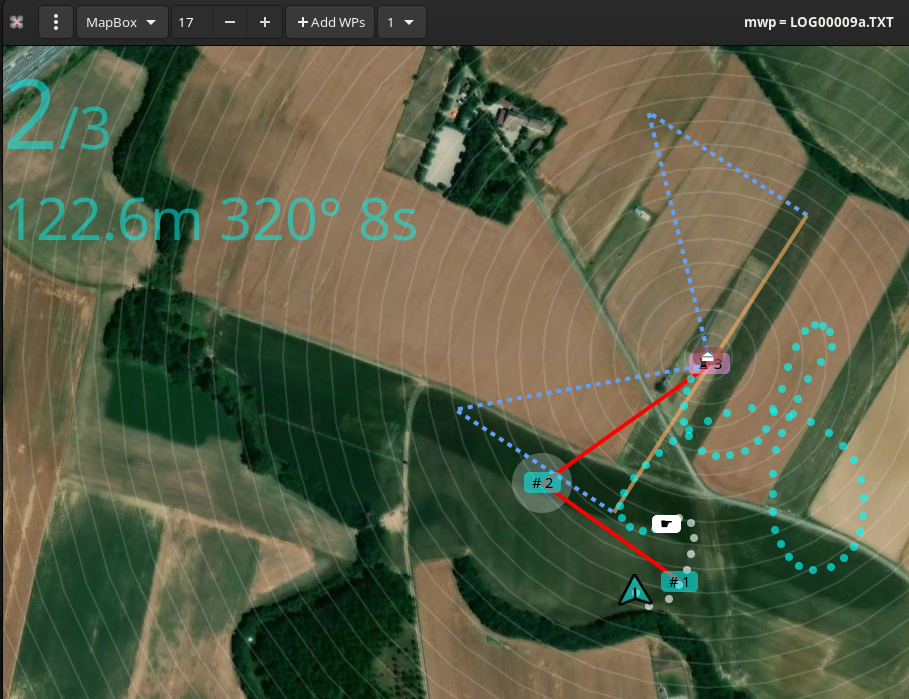
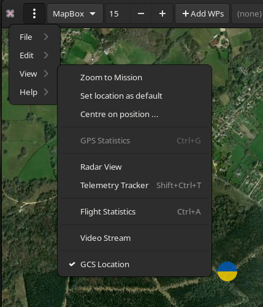

# Ground Control Station Features

## GCS Usage

### Basic functionality

* Real time tracking of vehicle via [telemetry](mwp-multi-procotol.md)
* Audio status reports
* OSD style WP information
* [Radar view](mwp-Radar-View.md) of other aircraft
* In picture [video feed display](mwp_video_player.md).

### Vehicle Track / Waypoints Colour Schemes

#### Flight Mode colours

| Mode | Colour |
| ---- | ------- |
| Piloted | Cyan `#00ffff` |
| Alt Hold | Blue `#03c0fa` |
| Cruise | Purple `#bf88f7` |
| FW Land | Pink `#ff92f0` |
| PosHold | Green `#4cfe00` |
| RTH | Yellow `#fafa00` |
| WP | White `#ffffff` |
| Undefined | Orange `#ff8000` |

#### Waypoint Colours

| Type | Colour |
| ---- | ------ |
| WAYPOINT | Cyan `#00ffff` |
| POSHOLD_TIME | Purple `#9846eb` |
| POSHOLD_UNLIM (MW) | Green `#4cfe00` |
| RTH | Blue `#00aaff` |
| LAND | Pink `#ff9af0` |
| JUMP | Magenta `#ed51d7` |
| SET_POI / SET_HEAD | Yellow `#ff9af0` |
| UNDEFINED | Grey `#e0e0e0` |
|(Home) | Brown `#8c4343` |

### OSD information

When flying waypoints, if the mission is also loaded into {{ mwp }}, {{ mwp }} can display some limited "OSD" information.

{: width="75%" }

Various settings (colour, items displayed etc.) are defined by [settings](mwp-Configuration.md#dconf-gsettings).

### GCS Location Icon

A icon representing the GCS location can be activated from the **View/GCS Location**" menu option.

By default, it will display a tasteful yellow / blue icon which one may drag around. It has a few other  purposes beyond showing some user specified location (but see [below](#radar)).

If you don't like the icon, you can override it [by creating your own icon](mwp-Configuration.md#settings-precedence-and-user-updates).

* If `gpsd` is detected (on `localhost`), then the position will be driven by `gpsd`, as long as it has  a 3D fix.

* The one  usage is when [inav-radar](mwp-Radar-View.md) is active; if the GCS icon is enabled (either by manual location or driven by `gpsd`), then rather than being a passive 'GCS' node, {{ mwp }} will masquerade as an 'INAV' node and advertise the GCS (icon) location to other nodes. This implies that you have sufficient LoRa slots to support this node usage.

* Another use is for {{ inav }} [Follow Me](mwp-follow-me.md) where the followed location can be driven by `gpsd`.
