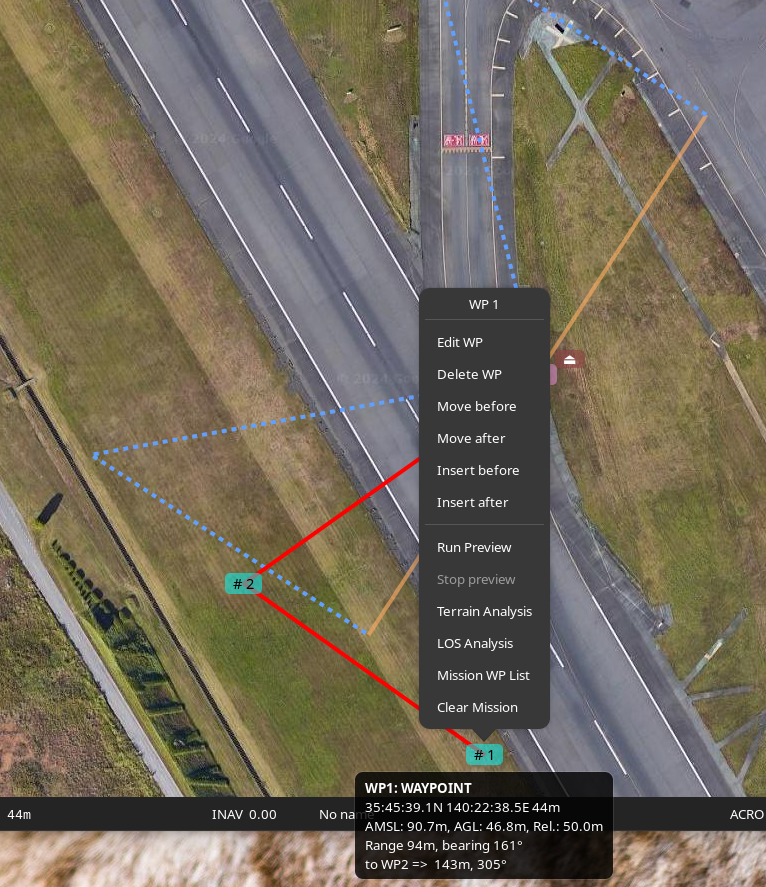
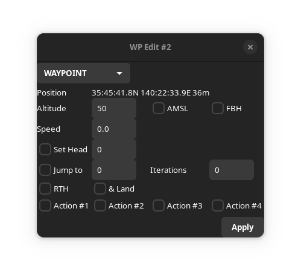
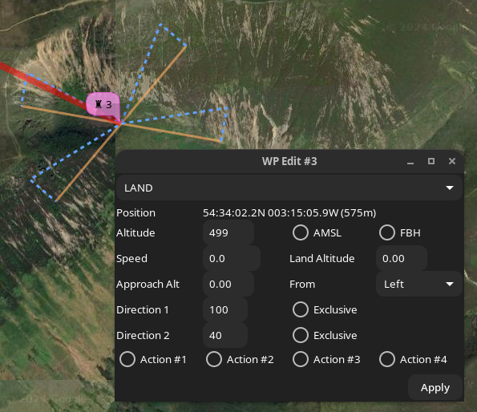
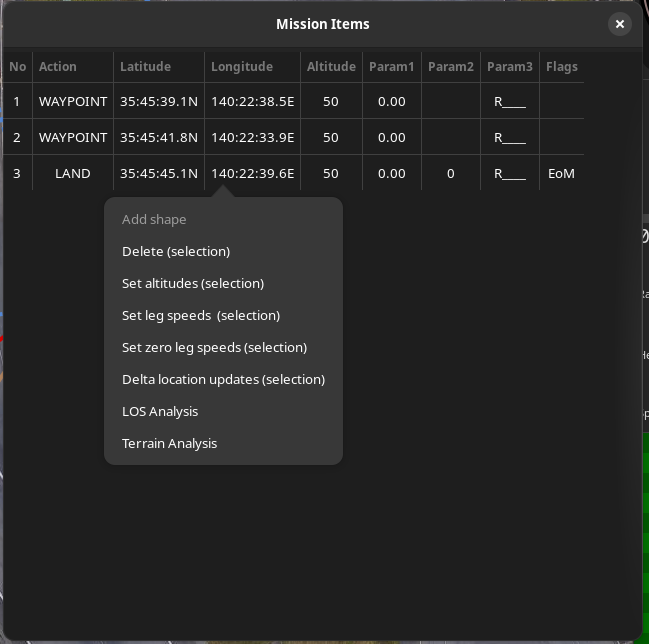
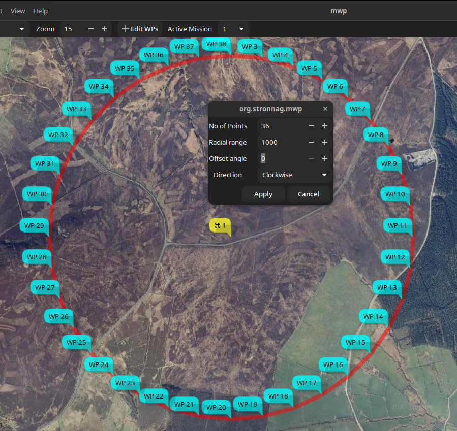
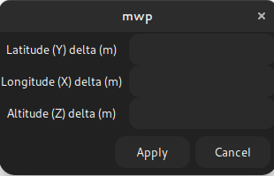
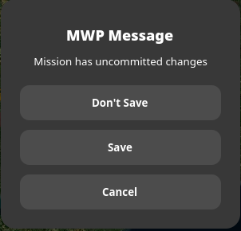

# Mission Editor

## Overview

The following chapters provide specific information for advanced {{ inav }} capability topics:

* [INAV multi-missions](inav-4.0-multi-missions.md)
* [INAV fly-by-home](Fly-By-Home-waypoints-(inav-4-new-feature).md)

Please note that some of the images in this chapter are from the legacy version of {{ mwp }}.

## Map Features

Missions may be added on the map by enabling mission add mode:

{: width="40%" }

This will:

* Display a notional home location (brown icon)
* Allow new WPs to be created by clicking on the map

WPs have a context popup menu via right click on a WP icon

{: width="30%" }

Almost all functions are available here, however some advanced functions, acting on multiple WP,  etc. requires the tabular mission editor.

### Edit Waypoint

The **Edit Waypoint** option opens an edit form for the current waypoint. The items displayed depend on the type of waypoint.

{: width="30%" }

In this image, note:

* The Way Point type `WAYPOINT`.
* The WP location (and absolute elevation AMSL)
* The WP Altitude, either absolute (here the ASML box is checked) or relative. Whether this is a [Fly By Home (FBH) waypoint](Fly-By-Home-waypoints-(inav-4-new-feature).md)
* The speed (m/s)
* Additional attributes which may be enabled or disabled:
    * Set Heading (-1 to clear a previous set head)
	* JUMP parameters (-1 Iterations == infinite)
	* Return to Home (and land).
* {{ inav }} 6.0, user defined actions 1-4. Invoked via INAV logic conditions.
* {{ inav }} 7.1.0, edit FW Approach (Auto-land) parameters for `LAND` WP types.

Multiple attributes may be set.

If the AMSL button is toggled, **and a valid planned home location** is set, then the altitude will be adjusted. For the above example, if the AMSL box is cleared, the dialogue shows:

{: width="30%" }

Note that the Altitude box has an orange border to show that the altitude has been automatically updated.

If there is no planned home location, and the AMSL box is toggled, then the Altitude box assumes a red border to indicate to the user that manual intervention is required.

{: width="30%" }

In the above image, a relative altitude of 16m has been toggled to absolute; there is no home position, so the altitude entry has a red border, as this is now below the absolute altitude of the terrain.

Note also that this example has multiple option set (SET HEAD and JUMP).

For a `LAND` WP, the FW Approach parameters are available.

{: width="30%" }

## Mission WP List

The Mission WP List may be invoked from the WP context menu.

It provides the following functions:

* Create, delete, modify, reorder waypoints.
* Context sensitive column titles for parameters
* Bulk updates (altitudes, speeds, position offsets)
* Automated path (polygon around a shape) generation.
* [Terrain Analysis](Mission-Elevation-Plot-and-Terrain-Analysis.md) and [Line of Sight Analysis](mwp-los-tool.md).

There is a right mouse context menu, the availability of items depending on whether zero, one or multiple items are selected.

{: width="30%" }

The `param3` value is presented as:

* `R` : Relative Altitude
* `A` : Absolute (AMSL) Altitude
* `[1234]` : User action set

The `flags` values are presented as:

* `EoM` : End of mission marker
* `FBH` : [Fly By Home (FBH) waypoint](Fly-By-Home-waypoints-(inav-4-new-feature).md)

### Common Operations

Many of the operations described below are shown in the videos, which probably provide a clearer explanation that any textual description could. Note also that many of these (images and videos) are legacy, but the concepts are still valid.

#### Add Shape

If a SET POI point is added to the mission, (there may also be other extant way-points), this option will display a dialogue to enter the number of points in a shape, the radial distance (from the SET POI to each point), an offset angle and the direction of rotation. i.e this defines a polygon around the POI.

{: width="35%" }

* The offset is relative to North. If you wanted the lines to be horizontal / vertical, specify an offset of 45° for a square.
* Shape points are appended to any extant mission points, and the shape tool may be invoked multiple times, for example to create 'concentric' circles.
* Once the shape is generated, the `SET_POI` point may be deleted, unless you really want `SET_POI` functionality.

#### Location Updates

Bulk location updates may be applied to selected waypoints.

{: width="30%" }

If an item if left black (or 0), then no adjustment is applied to that axis. Offsets are in metres, regardless of the user's preference distance unit.

#### Speed and Altitude updates

Bulk speed and altitude updates may be applied to selected waypoints. The altitude update allows either relative (to home) to absolute (ASL) altitudes.

#### Preview Mission

["Flys"](#mission-preview) an aircraft icon around the mission; this may be useful for predicting the behaviour of multiple embedded JUMPs.

#### Clear Mission

The Clear Mission option clears the mission. There is no confirmation, so be sure you really want to do this.

### Uncommitted Changes

If {{ mwp }} detects uncommitted changes when opening a new mission / downloading from the FC / cleanly exiting the application, then the user is presented with the following dialogue.

{: width="20%" }

* Don't Save : The mission is not saved, the original action completes.
* Save : The user is presented with a Save Dialog to save the mission.
* Cancel : The original action is cancelled.

## Advanced WP types / Video Tutorials

### JUMP, POSHOLD TIMED, LAND

[Video example](https://www.youtube.com/watch?v=w6M-v4qM5Yg) setting up JUMP, POSHOLD TIMED and LAND waypoints.

<iframe width="560" height="315" src="https://www.youtube.com/embed/w6M-v4qM5Yg" title="YouTube video player" frameborder="0" allow="accelerometer; autoplay; clipboard-write; encrypted-media; gyroscope; picture-in-picture" allowfullscreen></iframe>

### SET_POI, SET_HEAD as mission elements

[Video example](https://www.youtube.com/watch?v=RO5N9tbzNg8) SET_POI and SET_HEAD (real mission usage).

<iframe width="560" height="315" src="https://www.youtube.com/embed/RO5N9tbzNg8" title="YouTube video player" frameborder="0" allow="accelerometer; autoplay; clipboard-write; encrypted-media; gyroscope; picture-in-picture" allowfullscreen></iframe>

### Mission Preview

[Video example](https://www.youtube.com/watch?v=MTA42WUOjUY) of preview for a complex (multiple jumps, timed POSHOLD) mission (preview from the first video).

<iframe width="560" height="315" src="https://www.youtube.com/embed/MTA42WUOjUY" title="YouTube video player" frameborder="0" allow="accelerometer; autoplay; clipboard-write; encrypted-media; gyroscope; picture-in-picture" allowfullscreen></iframe>
