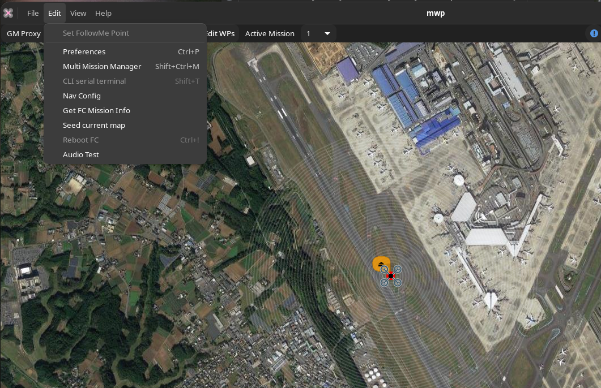
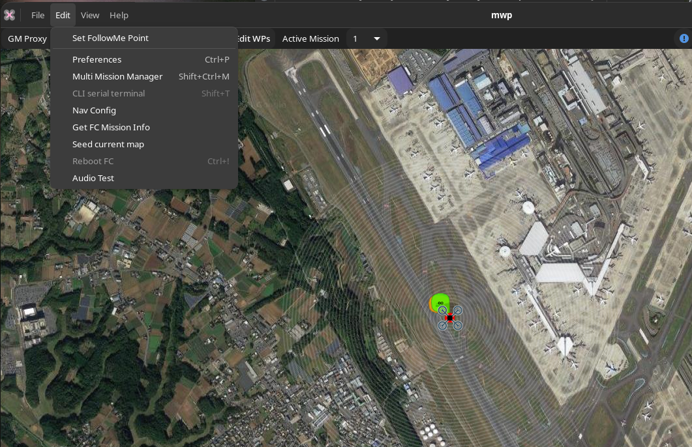
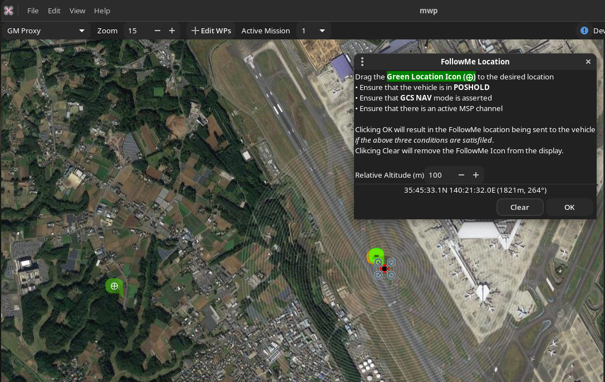

# mwp Follow Me

## Description

Since c. May 2023, {{ mwp }} supports an implementation of INAV's [Follow Me](https://github.com/iNavFlight/inav/wiki/INAV-Remote-Management,-Control-and-Telemetry#follow-me-gcs-nav).

In order to use this:

* There must be an active MSP link with the vehicle
* The vehicle must be armed
* The vehicle must be in `POSHOLD` with the `GCS NAV` mode also asserted.

Under the **Edit** menu, there is a new option **Set FollowMe Point**. Until you're armed and in POSHOLD this is not sensitive.

Now armed, but not POSHOLD (orange Home icon showing), still not sensitive ...

Now in POSHOLD. note the green POSHOLD icon ... menu option is sensitive!

Clicking the menu option invokes the FollowMe dialog:

The FollowMe desired location is indicated by the  *second* green icon (with the **⨁** symbol). This may be dragged to the required location. An altitude, relative to home may also be set, `0` means don't change altitude.

Once mwp has transmitted the desired location (WP#255), mwp will interrogate the FC for confirmation (WP#254, sic). This is logged, for example:

    11:31:38.530919 Special WP#254 (4) 35.772714 140.361790 20m 0°

## Caveats

It's probably 6 years since anyone has used this sort of INAV functionality, so take care. In particular, I'm not sure how well the altitude item works (in the firmware, mwp appears to send the correct data). So start will plenty of altitude and `0` as the altitude setting.

Note also that this has not been flight tested; the images and data tests have been done using the INAV  SITL (software in the loop), i.e. running INAV firmware as a desktop application, with [fl2sitl]( https://github.com/stronnag/bbl2kml/wiki/fl2sitl) as the (trivial) sensor provider and [ser2tcp]( https://github.com/stronnag/bbl2kml/tree/master/tools/ser2tcp) allowing a physical RX/TX to be used with the SITL.

In the event that someone flight tests this, a mwp "stderr" log and a blackbox log would be appreciated.
