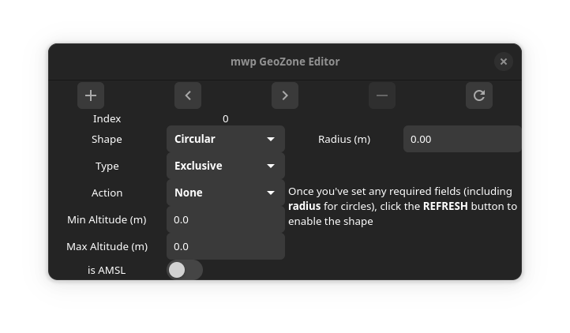
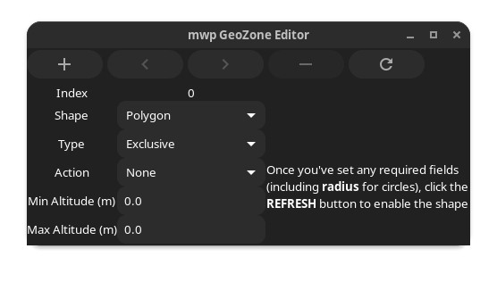
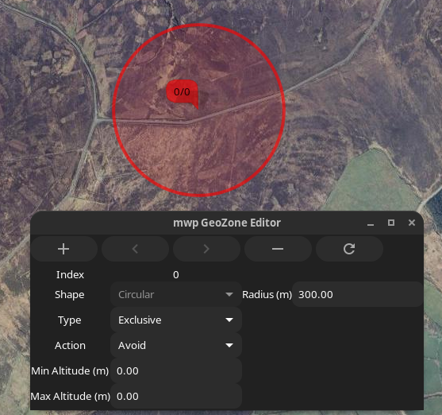
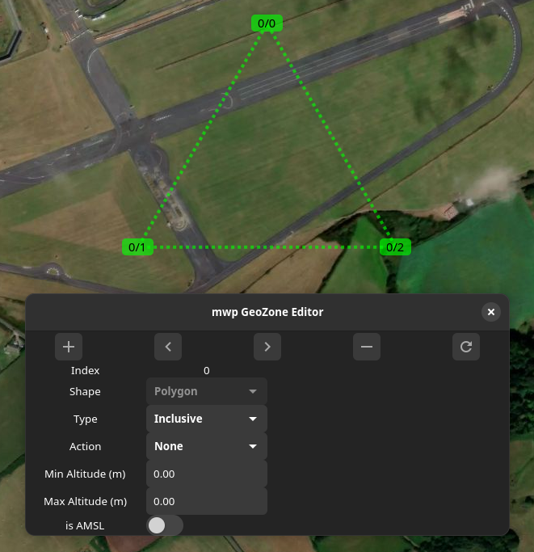
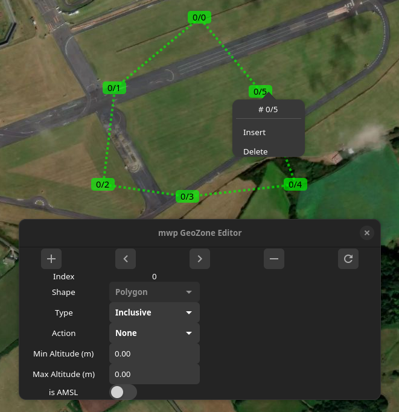
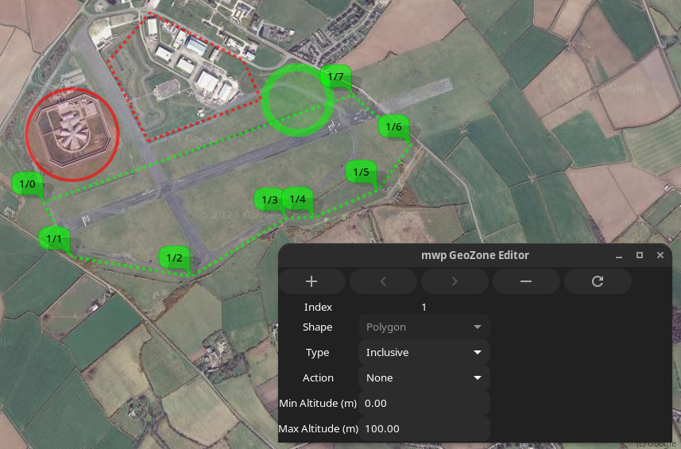

# mwp and Geozones

## Introduction

{{ mwp }} provides a UI for the Geozones function that is planned to appear in INAV 8.0.0.

As the technical details for this feature has not yet been made publicly available (other than *RTFS*), the implementation described below may be considered experimental; at least the user can generate colourful shapes ...

!!! Note "Version Requirements"
	The public API (MSP etc.) exposed in the initial INAV PR differs from the API described in earlier provisional documentation. The proposed INAV 8.0 implementation **requires** {{ mwp }} 24.11.11 or later.

Geozones provides (in theory at least) a set of geographical shapes that the FC can navigate around, characterised by:

* Shape
    - Circular
    - Polygon

* Type
    - Exclusive
    - Inclusive

* Action
    - None
    - Avoid
    - Poshold
    - RTH

The effect these parameters have on FC behaviour will, presumably, be made available once the Geozones function is publicly available in the firmware.

## mwp User interface

!!! note "Legacy Images"
    The images this section are from legacy mwp, however the capability is the same.

### Menu options

{{ mwp }} adds a Geozones menu option, with suboptions:

{: width="50%" }

Note that the **Save**, **Export**, **Clear**, **Download** and **Upload** options are not sensitive if no geozone is loaded. Once a geozone is loaded, some or all of these options will be enabled. The MSP options are only enabled if the FC offers `feature GEOZONE` with the INAV 8.0 `feature` value of `(1 << 4)`.

Note that if `feature GEOZONE` is present, {{ mwp }} will attempt to load Geozones from the FC if the setting `autoload-geozones` is true, e.g.:

    gsettings set org.stronnag.mwp autoload-geozones true

## User Interface

* Open, Save: Expects a textual definition in INAV CLI format
* Export: Exports a loaded Geozone to KML. Geozone specific parameters are stored in the KML such that the original Geozone in CLI notation could be reproduced from the KML.

### Editor

!!! note "Edit UI Images"
	The image immediately below represents the current Edit UI (it has the AMSL button); other Edit UI images are from an earlier instance without this button. The altitude values have no bearing on mwp's display of the Geozones, other than in the generated KML.

{: width="50%" }

The icons along the top are:

* "+": Create a new zone
* "<" : Move to previous zone
* ">" : Move to next zone
* "-" : Delete current zone
* "🗘" : Refresh : Refresh display / Start editing **new** zone

If there is no Geozone loaded, the editor is as shown at the "new zone" state: the "Shape" item is enabled and a note explains how to proceed. Note that to create a circular zone, the radius must be non-zero. If the "Shape" item is set to "Polygon", then no radius is required to proceed.

{: width="50%" }

Once the required details have been entered, pressing refresh draws the template shape. circle has a dragable centre and editable radius.

{: width="50%" }

A polygon has 3 points (the mimimum), each of which can be dragged.

{: width="50%" }

Additional points can be added immediately in front of an existing point from the right mouse menu.

{: width="50%" }

With multiple zones loaded (or created), the user can switch between zones using the `<` and `>` icons.

{: width="50%" }

## Zone Colours

{{ mwp }} sets line and fill characteristics for GeoZones according to the zone's `type` and `action`.

The default values are set as:

| Type      |  Action  | Line      | Fill     |
| ----------| ---------| ----------| -------- |
| Exclusive |  None    | red 4 4   |          |
| Exclusive |  Avoid   | red 4     | red      |
| Exclusive |  PosHold | red 10    | red      |
| Exclusive |  RTH     | red 10    | red      |
| Inclusive |  None    | green 4 4 |          |
| Inclusive |  Avoid   | green 4   |          |
| Inclusive |  PosHold | green 10  |          |
| Inclusive |  RTH     | green 10  | green    |

The values after the line colour are line width and optional dash width.

The default colours are those suggested by the user who requested that {{ mwp }} support GeoZones.

The default "red" and "green" colours have some opacity set:

| Type | Value |
| ---- | ----- |
| Line red | `rgba(255,0,0,0.625)` |
| Fill red | `rgba(255,0,0,0.125)` |
| Line green | `rgba(0,255,0,0.625)` |
| Fill green | `rgba(0,255,0,0.125)` |

Where line width is greater than 10, the opacity is further reduced by 20% to satisfy the author's aesthetic opinion.

### User definition

The user may specify their own colours by creating a _pipe separated_ file, `$HOME/.config/mwp/zone_colours`. This is a text file of the format:

    type|action|line_colour|line_width|line_dash|fill_colour

### User definition fields:

**Type:** The zone type as an integer (0-1 : Exclusive / Inclusive)

**Action**: The zone action as an integer (0-3 :  None / Avoid / Poshold / RTH).

**Line Colour**: see below for colour formats

**Line Width**: In pixels, as an integer

**Line Dash**: In pixels, as an integer; the line will alternate on/off using this value.

**Fill Colour**: see below for colour formats

### Colour defintion

Colours may be defined as:

* A "standard" name (taken from the [X11 "rgb.txt"](https://en.wikipedia.org/wiki/X11_color_names) file) ; or
* A hexadecimal value in the form `#rrggbb` or `#rrggbbaa` ; or
* A RGB colour in the form `rgb(r,g,b)`); or `rgba(r,g,b,a)`

Where `r`, `g`, `b` and `a` are respectively the red, green, blue and alpha colour values. In the "`rgb()`" format, `r`, `g`, and `b` are either integers in the range 0 to 255 or percentage values in the range 0% to 100%, and `a` is a floating point value in the range 0 to 1.

If the alpha component is not specified then it is set to be fully opaque.

For "standard X11 names", an opacity may be defined by appending a floating point value in the range 0 to 1.0 to the name, separated by a semi-colon, for example `steelblue;0.8`

### Example: default settings as `zone_colours` file

The default settings can be represented in a `zone_colours` file as:

    0|0|rgba(255,0,0,0.625)|4|4|
    0|1|rgba(255,0,0,0.625)|4|0|rgba(255,0,0,0.125)
	0|2|rgba(255,0,0,0.625)|10|0|rgba(255,0,0,0.125)
	0|3|rgba(255,0,0,0.625)|10|0|rgba(255,0,0,0.125)
	1|0|rgba(0,255,0,0.625)|4|4|
	1|1|rgba(0,255,0,0.625)|4|0|
	1|2|rgba(0,255,0,0.625)|10|0|
	1|3|rgba(0,255,0,0.625)|10|0|rgba(0,255,0,0.125)

Where fill is not required, it is left blank.

If a line cannot be parsed, an error will the logged, giving the offending line number(s).
Blank lines and comment lines (starting with `#` or `;`) are ignored.

Please also note that floating point values must be specified with a _point_ (`.`), even when the locale customary format would use _comma_ (`,`).

Alternate colour expressions for the first line above are therefore:

    0|0|red;0.625|4|4|
    0|0|#ff0000a0|4|4|
