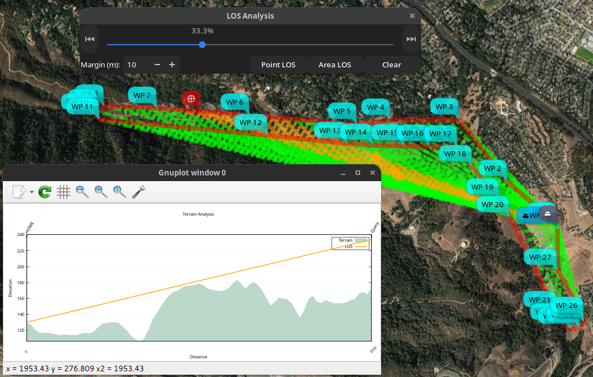

# mwp Line of Sight (LOS) Tool

## Overview

{{ mwp }} provides a LOS tool that establishes whether there is LOS between the observer location (the mwp home icon) and arbitrary points on an {{ inav }} mission. This is may be useful to establish:

* Can the pilot or observer see the aircraft?
* Is there LOS for RC control or video?

## Caveats

There are a number of issues to take into consideration.

* Online DEMs (Digital Elevation Model) vary [significantly](Mission-Elevation-Plot-and-Terrain-Analysis.md/#datum), with implications for accuracy.
* Bing Elevations (BE) limits a single query to 1024 points, the data is 30m grid (best case). BE is actually more generous than most online sources.
* The mwp uses the lesser of (mission length / 30) (metres) or 1024 points.

Please be aware of these accuracy / fidelity issues when evaluating the results of any elevation analysis.

## Invocation

LOS is invoked from any waypoint using the right mouse button. There are two specific options:

{: width="30%" }

* **LOS Analysis** : The user can select locations on the mission via a slider and run an analysis. A LOS calculation is performed, a graphical view is shown and a red (no LOS) or green (LOS) line is displayed on the map from the observer (home location) to the chosen location. This may be repeated as required.
* **Auto LOS** : The calculation is performed automatically with 1% increments of the mission length. A set of resulting red or green LOS lines is displayed om the map. This requires that the user has [applied their own Bing API key](#user-bing-key).

## Examples

Note that when the LOS slider is displayed, the only UI actions available are:

* Scroll the map
* Zoom the map
* Change the map product

This restriction means that the mission cannot be changed while a LOS Analysis is being performed.

### Manual LOS Analysis

In the image below, the user has selected "LOS Analysis" from the right mouse menu at WP9. The slider is positioned appropriate to WP9. Note that if the mission contains JUMP WPs, these are executed once only (regardless of the mission setting). This is why the slider might appear less advanced compared to the mission length if the JUMP is ignored. The user can reposition the WP using the slider.

When "Perform LOS" is clicked, the LOS is calculated between planned home (brown icon, lower left) and the red "⨁" "Point of Interest" (POI) icon. This is displayed as a terrain plot with the LOS line superimposed over the terrain elevation. The line is red as there is no LOS (it would be green where there is LOS). A red "dot-dash" is also displayed on the map.

The user may repeat the "move slider" / "Perform LOS" action as required. The prior terrain plot is removed each time "Perform LOS" is selected; the lines on the map are removed when the slider dialog is closed.

### Auto LOS

If the user has specified a [user supplied Bing API key](#user-bing-api-key), then an Auto LOS analysis can be run. The analysis is iterated along the mission path automatically.

The image shows the state at the end of the analysis. While the analysis is running, the slider and "Perform LOS" are not sensitive; once the run has completed, these controls are available if the user wishes to investigate further.

Here we can see that there is an area of the mission (SE quadrant) where there is no LOS.

## User Bing API Key

In the same way that the INAV Configurator requires the user to have their own Bing API key, this is also required for the [Auto LOS](#auto-los) option. Details on now to obtain a key can be found in the [INAV Configurator README](https://github.com/iNavFlight/inav-configurator#how-to-get-the-bing-maps-api-key).

The user's Bing API key should be added to the user's `$HOME/.config/mwp/cmdopts` [file](mwp-Configuration.md#cmdopts), for example:

    #--debug-flags 20
    --dont-maximise

    MWP_BLACK_TILE=/home/jrh/.config/mwp/mars.png
    MWP_TIME_FMT=%T.%f
    MWP_BING_KEY=Axxxxxxxxxxxxxxxxxxxxxxxxxxxxxxxxxxxxxxx

This requirement is to help prevent the generic application API key running into usage limits,
