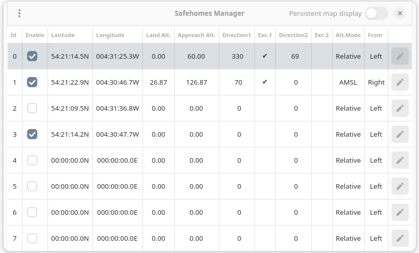
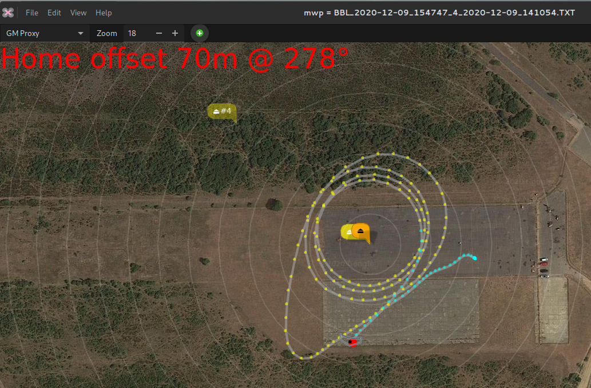

# mwp and INAV safehome

One of the great features of {{ inav }} 2.6 was the `safehome` capability. The user can define of set of up to eight locations, and if any of these is within 200m (configurable up to 650m in {{ inav }} 2.7), then that is used as the home location for RTH (and RTH failsafe).

## INAV setting

`safehome` is set in {{ inav }} using the CLI, here's an example:

    # safehome
    safehome 0 1 508047750 -14948970
    safehome 1 1 509102384 -15344850
    safehome 2 1 509390336 -14613540
    safehome 3 1 509149619 -15337365
    safehome 4 0 508054891 -14961431
    safehome 5 0 543545392 -45219430
    safehome 6 0 540954148 -47328458
    safehome 7 0 0 0

As you see, it's not too user friendly; the parameters are

* Index (0 - 7)
* Status (0 = don't use, 1 = can use)
* Latitude as degrees * 10,000,000 (i.e. 7 decimal places)
* Longitude as degrees * 10,000,000 (i.e. 7 decimal places)

It can be error prone to get locations into the correct format, particularly when a common source (Google Maps) only provides 6 decimal places of precision.

## mwp solution

### Graphical User Interface

Note: Since mwp 7.32.?, mwp provides additional fields for the Autoland function that will / may appear in INAV 7.1.0 (or later). As the technical details for this feature has not yet been made publicly available, its extended MSP is not supported. The additional fields beyond those described below should be considered experimental.

{{ mwp }} now offers a `Safe Homes` menu option:

{: width="25%" }

This will launch the `Safe Home` window:

{: width="50%" }

From here it is possible to:

* Load safehomes from a file in CLI format. A CLI diff or dump can be  used.
* Save safehomes to a file in CLI format. If a CLI diff or dump is selected, then only the safehomes stanza is changed; other information in the diff / dump is preserved.
* Display safehomes on the map. Active safehomes are displayed with greater opacity than inactive locations.
* Change the status (active, inactive). If a previously unused item is enabled, an icon is placed on the centre of the map for positioning.
* Clear (unset) one or all safehomes.

Note that editing functions are only available when the `Safe Homes` window is active; if the windows is dismissed with icons displayed, then the icons remain on the map, but are not editable.

### Display safehomes at startup

It also is possible to set a `gsettings` key to define a file of safehomes to load at startup, and optionally display (readonly) icons.

    gsettings set org.mwptools.planner load-safehome ~/.config/mwp/safehome.txt,Y

This sets the default safehomes file to `~/.config/mwp/safehome.txt` and the appended `,Y` means display the icons on the map.

### Example

The image below shows a blackbox replay. Note that the flight home location (brown icon) is coincident with the pale orange safehome icon.

{: width="50%" }
